# System Architecture

The Thermographic Imaging Analysis Agent is built on a decoupled, pipeline-centric architecture that separates raw data processing (Vision) from clinical reasoning (Agentic Graph).

## 0. System Pipeline Diagram

```mermaid
graph TD
    subgraph Data_Ingestion [Data Ingestion]
        A[Raw Excel Data .xlsx] --> B[NumPy Temperature Matrix]
        P[PNG Images] --> UI[Frontend Dashboard]
    end

    subgraph Vision_Pipeline [Vision Pipeline: processor.py]
        B --> C{Thermal Thresholding}
        C -->|26°C - 38°C| D[Binary Skin Mask]
        D --> E[Morphological Cleaning]
        E --> F[Contour Detection]
        F --> G[ROI Extraction: Left vs Right Leg]
        G --> H[Statistical Extraction]
        H -->|Mean, Max, Asymmetry| I[Cleaned Metrics]
    end

    subgraph Reasoning_Pipeline [Reasoning Pipeline: graph.py]
        I --> J[Node: Clinical Interpreter]
        J --> K[Node: Risk Assessor]
        K --> L[Node: Recovery Planner]
        L --> M[Stateful Graph Output]
    end

    subgraph Delivery_Layer [Delivery Layer]
        M --> N[FastAPI Backend]
        N --> UI
    end
```

---

## 1. Data Flow Overview

1.  **Input**: The system ingests raw thermal data in two formats:
    *   `.png`: Visual representation for the UI.
    *   `.xlsx`: High-precision temperature grids (matrix of floats).
2.  **Processing (Vision Layer)**: Extracts high-signal metrics from the raw matrix.
3.  **Reasoning (Agentic Layer)**: Interprets metrics and generates protocols.
4.  **Delivery**: Unified FastAPI server delivers the UI and API from a single port.

---

## 2. The Vision Pipeline (`processor.py`)

Unlike basic analysis which averages the entire image, our pipeline implements **Thermal Segmentation**:

*   **Skin Masking**: We apply a thermal threshold (26°C - 38°C) to the raw data. This removes the "cold" background noise (room temp) and "hot" non-human artifacts.
*   **Morphological Cleanup**: We use OpenCV kernels to perform "Opening" (removing noise) and "Closing" (filling gaps in the skin surface).
*   **Limb ROI Identification**: The system uses contour detection to identify the two largest vertical blobs. It then sorts them by X-coordinate to isolate the **Left Leg** and **Right Leg**.
*   **Precise Asymmetry**: Asymmetry is calculated by comparing the mean of the masked pixels for each leg, ensuring we are only comparing skin-to-skin.

---

## 3. The Reasoning Pipeline (`graph.py`)

We utilize **LangGraph** to manage the diagnostic workflow. This allows for complex, stateful decision-making that is more robust than traditional conditional logic.

### Graph Nodes:
1.  **`interpreter`**: Consumes raw stats (mean, max, asymmetry) and generates a clinical summary.
2.  **`risk_assessor`**: A specialized node that classifies the athlete's risk level (Low, Medium, High) based on physiological deviations.
3.  **`planner`**: A node that generates actionable recovery protocols (e.g., cryotherapy vs. active rest).

### Graph Advantages:
*   **Traceability**: Each step of the "thought process" is captured in the Graph State.
*   **Modularity**: Nodes can be easily upgraded to full LLM calls (GPT-4/Claude) without changing the core backend logic.
*   **Conditional Logic**: The graph can be extended to route high-risk cases to an additional `medical_alert` node.

---

## 4. Deployment Architecture

The system is designed for "Single-Binary" style simplicity:
*   **Vite** compiles the React frontend into a static `dist` folder.
*   **FastAPI** mounts this folder at the root `/`.
*   **Internal API** routes are prioritized over static file serving.
*   **`uv`** handles the environment, ensuring that complex dependencies like OpenCV and LangGraph are managed with zero-config for the user.
